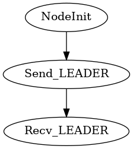
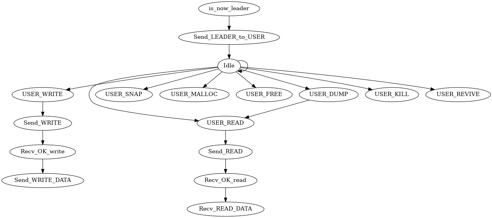
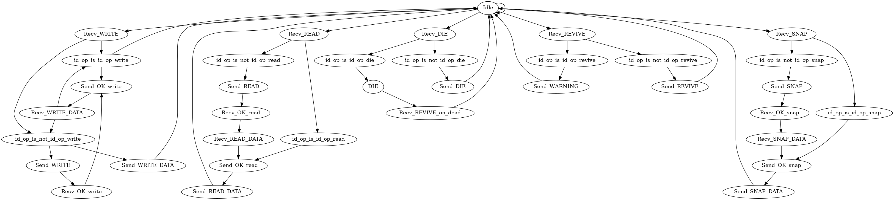

# DistributedMalloc

Yet another malloc working on distributed systems. (Big Malloc)

# Usage

In a build directory:

```sh
mkdir build
cd build
cmake ..
make
mpirun --hostfile ../hostfile dmalloc [DOTFILE]
```

In project directory:

```sh
cmake .
make
mpirun --hostfile hostfile dmalloc [DOTFILE]
```

The *run.sh* script execute **mpirun** on build/dmalloc, takes 1 argument for number of nodes,
default is 20.


# Tooltips

* How to display a graph

    ```bash
    sudo apt install xdot
    xdot GRAPH_NAME.dot
    ```

# Todo

* New features
* Byzantine
* Snap

## Command Line of dmalloc

dmalloc commands:

| **Command**                   | **Desc.**                                               |
|-------------------------------|---------------------------------------------------------|
| h                             | display all available commands with their description   |
| t                             | show table of allocations                               |
| m `size`                      | return `address` to cmd user of the required allocation |
| f `address`                   | free address, Warning if already free                   |
| w `address` `datasize` `data` | write at the address the data of size datasize          |
| w `address` `file`            | write all content of file at address                    |
| w `address` `file` `datasize` | write datasize bytes from file to the address           |
| r `address` `datasize`        | read datasize bytes at address                          |
| r `address` `file`            | read all bytes of the block at address into file        |
| r `address` `file` `datasize` | read datasize bytes at address into file                |
| d `address`                   | dump in as text all data of the block stored in address |
| d net                         | dump all allocation                                     |
| kill `node_id`                | kill node refered by `id`                               |
| revive `node_id`              | revive `id`                                             |


## Important structs/classes

* **Node**
* **Message**
  * id_s (source)
  * id_t (target)
  * id_o (final target for operation or additional information)
  * need_callback (does this message require an ALIVE callback)
  * size
  * address
  * enum *Op*
    * OK
    * MALLOC
    * FREE
    * WRITE
    * READ
    * SNAP
    * LEADER
    * WHOISLEADER
    * (REVIVE)
    * (DIE)
    * (TEST)
    * NONE
    * DUMP
    * LEADER_OK (leader election is over + a success)
    * ALIVE (callback, proving its aliveness)
    * LEADER_AGAIN (supposed leader is dead, need to retart the election)
* **Block**
  * Linked list of:
    * address
    * size
    * id (the machine containing this address)
    

## Node Life Cycles (OUTDATED)!

### Node Leader Elections



### Node Leader Cycle



### Node Cycle



